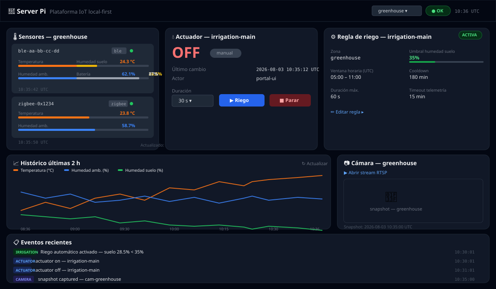
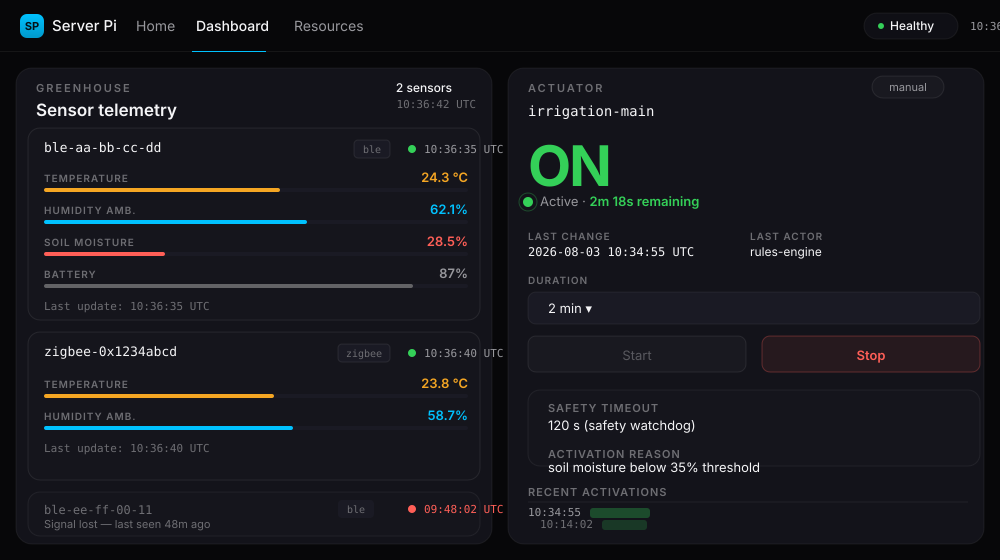

# server-pi local-first IoT platform

Plataforma IoT **local-first** para domótica y monitorización de cultivo en Raspberry Pi.

## Capturas de pantalla

### Panel principal — vista general



*Vista completa: sensores en tiempo real con barras de progreso y estado, control del actuador de riego con selector de duración, regla de autoriego configurable inline, gráfico histórico de las últimas 2 horas y log de eventos.*

### Sensores y control de actuador



*Detalle de las tarjetas de sensores (temperatura, humedad ambiental, humedad de suelo y batería) con indicador de estado de señal en tiempo real, y panel de control del actuador con selector de duración variable.*

## Arquitectura (diagrama textual)

```text
[Sensores BLE] --(BLE scan)--> [ble-collector] --MQTT--> [Mosquitto]
[Sensores Zigbee] --> [Zigbee2MQTT] --MQTT--> [Mosquitto]

[FastAPI API]
  - suscribe MQTT sensores normalizados
  - publica comandos actuadores
  - ejecuta reglas de autoriego
  - integra cámara RTSP/snapshots
  - persiste métricas/eventos en InfluxDB

[InfluxDB] <--> [Grafana dashboards provisionados]
```

## Requisitos hardware/software

- Raspberry Pi 4/5 (recomendado Pi 5)
- Dongle Zigbee compatible con Zigbee2MQTT
- Sensores BLE y/o Zigbee de temperatura/humedad/suelo
- Actuadores conectados mediante relés compatibles (riego/luz/ventilación)
- Cámara Xiaomi con RTSP local habilitado (si el modelo lo soporta)
- Docker Engine + Docker Compose plugin

## Estructura principal

- `docker-compose.yml`: stack principal IoT
- `src/server_pi/api/`: backend FastAPI
- `src/server_pi/ble_collector/`: escaneo BLE y publicación MQTT
- `src/server_pi/rules_engine/`: motor de reglas de riego
- `src/server_pi/common/`: modelos, configuración y persistencia
- `deploy/`: configuraciones de mosquitto/zigbee2mqtt/grafana y Dockerfiles
- `tests/`: pruebas unitarias e integración mínima
- `docs/TOPICS.md`: convención de tópicos MQTT
- `docs/DECISIONS.md`: decisiones técnicas y trade-offs

## Instalación rápida

1. Copiar variables de entorno:

```bash
cp .env.example .env
```

2. Ajustar `.env` (en especial `ZIGBEE_DEVICE`, `CAMERA_RTSP_URL`, credenciales y puertos).

3. Levantar servicios:

```bash
docker compose up -d --build
```

4. Verificar salud:

```bash
curl http://localhost:${API_PORT:-8000}/health
```

Portal web:

```bash
open http://localhost:${API_PORT:-8000}/
```

El portal incluye: selector de zona, badge de salud del sistema, sensores con barras de progreso e indicador de señal, control de riego con selector de duración, configuración inline de regla de autoriego, gráfico histórico y log de eventos.

## Emparejamiento Zigbee y BLE

### Zigbee

1. Abre `http://<host>:${Z2M_PORT:-8080}`.
2. Activa `permit_join` temporalmente en Zigbee2MQTT.
3. Empareja dispositivos.
4. Desactiva `permit_join` al terminar.

### BLE

- `ble-collector` escanea periódicamente y publica en MQTT `cultivo/<zona>/sensor/<device>/state`.
- Configura:
  - `BLE_SCAN_INTERVAL_SEC`
  - `BLE_MIN_PUBLISH_INTERVAL_SEC`
  - `DEFAULT_ZONE`

## Configuración cámara Xiaomi

- Preferente: `CAMERA_RTSP_URL` con stream RTSP local.
- Alternativa: `CAMERA_SNAPSHOT_SOURCE_URL` para captura HTTP.
- Snapshots se guardan en `/data/snapshots` del contenedor API con retención en días.

Endpoint de cámara:

```bash
curl http://localhost:${API_PORT:-8000}/api/v1/camera
```

## API disponible

### Health

```bash
curl http://localhost:${API_PORT:-8000}/health
```

### Últimos sensores por zona

```bash
curl "http://localhost:${API_PORT:-8000}/api/v1/sensors/latest?zone=greenhouse"
```

### Histórico

```bash
curl "http://localhost:${API_PORT:-8000}/api/v1/sensors/history?device_id=ble-aa-bb&from=2026-07-01T00:00:00Z&to=2026-07-01T23:59:59Z"
```

### Comando manual de actuador

```bash
curl -X POST "http://localhost:${API_PORT:-8000}/api/v1/actuators/irrigation-main/command" \
  -H 'Content-Type: application/json' \
  -d '{
    "ts":"2026-07-29T12:00:00Z",
    "zone":"greenhouse",
    "actor":"operator",
    "reason":"manual check",
    "action":"on",
    "duration_sec":30,
    "mode":"manual"
  }'
```

### Estado de actuador

```bash
curl "http://localhost:${API_PORT:-8000}/api/v1/actuators/irrigation-main/state?zone=greenhouse"
```

### Crear/actualizar regla de riego

```bash
curl -X POST "http://localhost:${API_PORT:-8000}/api/v1/rules/irrigation?actuator_id=irrigation-main" \
  -H 'Content-Type: application/json' \
  -d '{
    "zone":"greenhouse",
    "enabled":true,
    "soil_moisture_threshold_pct":35,
    "allowed_start_hour_utc":5,
    "allowed_end_hour_utc":11,
    "cooldown_minutes":180,
    "max_duration_sec":60,
    "telemetry_timeout_minutes":15
  }'
```

### Consultar regla de riego activa

```bash
curl "http://localhost:${API_PORT:-8000}/api/v1/rules/irrigation?actuator_id=irrigation-main"
```

### Eventos

```bash
curl "http://localhost:${API_PORT:-8000}/api/v1/events?limit=100"
```

## Seguridad mínima operativa implementada

- Actuadores en `OFF` por defecto al reinicio (estado persistido con inicialización segura).
- Timeout de seguridad por activación (`duration_sec` y `ACTUATOR_DEFAULT_TIMEOUT_SEC`).
- Validación estricta de payloads con Pydantic (`extra=forbid`, tipos estrictos).
- Persistencia y timestamps en UTC.
- Failsafe de telemetría en motor de reglas (autoapagado si expira señal crítica).

## Dashboards/Grafana

- Grafana provisionado automáticamente con datasource InfluxDB.
- Dashboard inicial: `Server Pi Cultivo`.
- Objetivo mínimo: tiempo real + histórico + eventos.

## Testing y calidad

```bash
python -m pip install -e .[dev]
ruff check src tests
black --check src tests
pytest
```

## Troubleshooting

- `api` no conecta MQTT: revisar `MQTT_HOST`, `MQTT_PORT` y logs de `mosquitto`.
- Sin datos BLE: verificar permisos Bluetooth en host y disponibilidad de adaptador.
- Sin datos Zigbee: validar `ZIGBEE_DEVICE` y estado del dongle USB.
- Snapshot fallido: revisar disponibilidad de `ffmpeg` o URL HTTP configurada.
- Grafana sin métricas: comprobar bucket/token/org de InfluxDB.

## Consideraciones de seguridad eléctrica (actuadores)

- Usa relés con aislamiento óptico y fuente de alimentación adecuada.
- Añade fusibles y protecciones térmicas en bombas/motores.
- Mantén cableado de potencia separado de señal.
- Define parada física de emergencia independiente del software.
- Prueba en vacío antes de conectar cargas reales.
